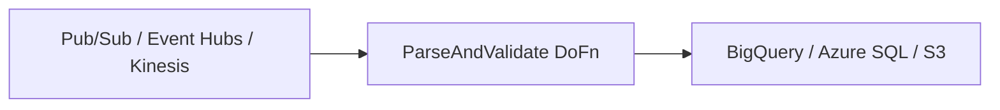

# Beam Multi-Cloud PoC

One Apache Beam pipeline. Three clouds. Only the I/O changes.

Demonstrates a portable real-time ingestion pipeline that runs on:
- **GCP** → Pub/Sub → Dataflow → BigQuery
- **Azure** → Event Hubs → Synapse Spark → Azure SQL
- **AWS** → Kinesis → Glue → S3

The business logic (`ParseAndValidate` DoFn) is **identical** across all three.
Only the source and sink connectors differ.

## Architecture



## Quick Start

### 1. Install dependencies
```bash
pip install -r requirements.txt
```

### 2. Run locally (DirectRunner)
```bash
python poc_pipeline.py \
  --input_subscription="projects/YOUR_PROJECT/subscriptions/poc-sub" \
  --output_table="YOUR_PROJECT:poc_dataset.events" \
  --runner=DirectRunner \
  --streaming
```

### 3. Deploy to Dataflow
```bash
./deploy.sh
```

### 4. Publish a test message
```bash
gcloud pubsub topics publish poc-topic \
  --message='{"name":"user_1","customer_id":1,"amount":99.5}'
```

### 5. Verify
```bash
bq query --use_legacy_sql=false \
  'SELECT * FROM `YOUR_PROJECT.poc_dataset.events` LIMIT 10'
```

## Cloud Portability

| Layer | GCP | Azure | AWS |
|---|---|---|---|
| Source | `ReadFromPubSub` | `ReadFromEventHubs` | `ReadFromKinesis` |
| Transform | `ParseAndValidate` | **Same** | **Same** |
| Sink | `WriteToBigQuery` | `WriteToJdbc` | `WriteToText` |

## What's Portable vs. What's Not

- ✅ **Transform logic** — pure Python, no cloud SDK
- ✅ **Pipeline DAG** — Beam graph is identical
- ❌ **I/O connectors** — swap per cloud
- ❌ **Runtime** — Dataflow / Synapse / Glue
- ❌ **Auth** — IAM / Entra ID / IAM

## Files

- `poc_pipeline.py` — the Beam pipeline
- `deploy.sh` — Dataflow deployment script
- `diagrams/` — Mermaid source for all architecture diagrams

## License

MIT
